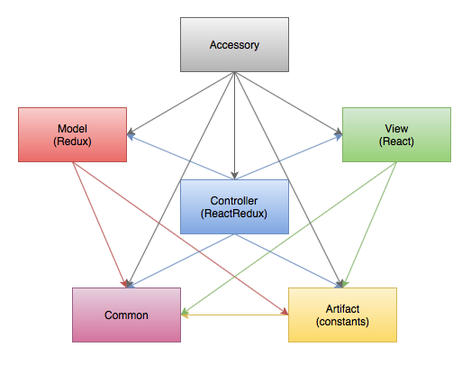

# X-Wing Miniatures Game
Play the game: [X-Wing Miniatures Game](https://rawgit.com/jmthompson2015/xwing-miniatures-game/master/src/index.html)

#### Accessories
* [Ability Table](https://rawgit.com/jmthompson2015/xwing-miniatures-game/master/src/accessory/ability-table/AbilityTable.html)
* [Condition Card Gallery](https://rawgit.com/jmthompson2015/xwing-miniatures-game/master/src/accessory/condition-card-gallery/ConditionCardGallery.html)
* [Damage Card Gallery](https://rawgit.com/jmthompson2015/xwing-miniatures-game/master/src/accessory/damage-card-gallery/DamageCardGallery.html)
* [Damage Table](https://rawgit.com/jmthompson2015/xwing-miniatures-game/master/src/accessory/damage-table/DamageTable.html)
* [Game Data Table](https://rawgit.com/jmthompson2015/xwing-miniatures-game/master/src/accessory/game-data-table/GameDataTable.html)
* [Pilot Card Gallery](https://rawgit.com/jmthompson2015/xwing-miniatures-game/master/src/accessory/pilot-card-gallery/PilotCardGallery.html)
* [Pilot Table](https://rawgit.com/jmthompson2015/xwing-miniatures-game/master/src/accessory/pilot-table/PilotTable.html)
* [Ship Gallery](https://rawgit.com/jmthompson2015/xwing-miniatures-game/master/src/accessory/ship-gallery/ShipGallery.html)
* [Squad Builder](https://rawgit.com/jmthompson2015/xwing-miniatures-game/master/src/accessory/squad-builder/SquadBuilder.html)
* [Squad Table](https://rawgit.com/jmthompson2015/xwing-miniatures-game/master/src/accessory/squad-table/SquadTable.html)
* [Upgrade Card Gallery](https://rawgit.com/jmthompson2015/xwing-miniatures-game/master/src/accessory/upgrade-card-gallery/UpgradeCardGallery.html)
* [Upgrade Table](https://rawgit.com/jmthompson2015/xwing-miniatures-game/master/src/accessory/upgrade-table/UpgradeTable.html)

## Built With
* [Immutable](https://facebook.github.io/immutable-js/) - Immutable collections for JavaScript.
* [QUnit](https://qunitjs.com/) - JavaScript unit testing.
* [React](http://facebook.github.io/react/) - A JavaScript library for building user interfaces.
* [ReactRedux](https://github.com/reactjs/react-redux) - Official React bindings for Redux.
* [Reactable](http://glittershark.github.io/reactable/) - Fast, flexible, and simple data tables in React.
* [Redux](https://redux.js.org/) - A predictable state container for JavaScript apps.
* [Require.js](http://requirejs.org/) - A JavaScript file and module loader.
* [Tachyons](http://tachyons.io) - An atomic CSS library.
* [xwing-data](https://github.com/guidokessels/xwing-data/) - An easy-to-use collection of data and images from X-Wing: The Miniatures Game by Fantasy Flight Games.
* [xwing-miniatures-font](https://github.com/geordanr/xwing-miniatures-font) - Vector font for X-Wing: The Miniatures Game by Fantasy Flight Games.

## Architecture

#### Common
Contains generic utilities and JavaScript extensions. (e.g. Logger, InputValidator, etc.)

#### Artifact
Contains game data implemented as constant enumerations. (e.g. Ship, PilotCard, UpgradeCard, etc.)

#### Model
Provides the data model and processes using Redux.

#### View
Provides the GUI components using React.

#### Controller
Provides integration between the model and the view. Data changes are propagated to the view components, and user actions are transmitted to the model.

#### Accessory
Contains accessory applications.

## License
X-Wing Miniatures Game is released under the terms of the [MIT License](https://github.com/jmthompson2015/xwing-miniatures-game/blob/master/LICENSE.txt).

***
Star Wars, X-Wing: Miniatures Game and all related properties, images and text are owned by Fantasy Flight Games, Lucasfilm Ltd., and/or Disney.
